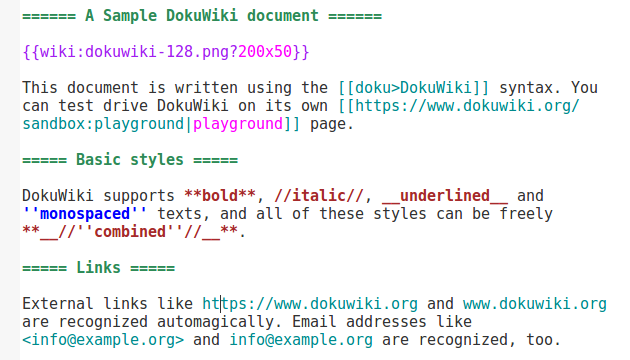

This is a [GtkSourceView](https://wiki.gnome.org/Projects/GtkSourceView) language file for the [DokuWiki](https://www.dokuwiki.org/) syntax. It provides syntax coloration for the [gedit](https://wiki.gnome.org/Apps/Gedit) editor.

## Installation

Place a copy of the `dokuwiki.lang` file into either one of these directories:

*  `~/.local/share/gtksourceview-3.0/language-specs/`
*  `/usr/local/share/gtksourceview-3.0/language-specs/`
*  `/usr/share/gtksourceview-3.0/language-specs/`

Start or restart *gedit* and open a *DokuWiki* document. Files ending with the `.doku` and `.dokuwiki` extensions will be immediately highlighted.

## Project Status

This language file contained in this project has been assembled for personal use and has not been widely tested.

It supports coloration for the following *DokuWiki* plugins:

* [Definition List](https://www.dokuwiki.org/plugin:definitionlist)
* [Comment Syntax](https://www.dokuwiki.org/plugin:commentsyntax) (C-style comments and one-line comments)
* [Changemarks](https://www.dokuwiki.org/plugin:changemarks)
* [LaTeX](https://www.dokuwiki.org/plugin:latex) (mathematical expressions)
* [Graphviz](https://www.dokuwiki.org/plugin:graphviz) ([dot](http://www.graphviz.org/content/dot-language) syntax)

## License

This language definition file is to be used with GtkSourceView

GtkSourceView is free software; you can redistribute it and/or modify it under the terms of the GNU Lesser General Public License as published by the Free Software Foundation; either version 2.1 of the License, or (at your option) any later version.

GtkSourceView is distributed in the hope that it will be useful, but WITHOUT ANY WARRANTY; without even the implied warranty of MERCHANTABILITY or FITNESS FOR A PARTICULAR PURPOSE.  See the GNU Lesser General Public License for more details.

This language definition file is licensed under the GNU Lesser General Public License 3.0.

You should have received a copy of the GNU Lesser General Public License along with this library; if not, write to the Free Software Foundation, Inc., 51 Franklin St, Fifth Floor, Boston, MA  02110-1301  USA

A copy is provided with this package (see LICENSE) or can be obtained at:

http://www.gnu.org/licenses/lgpl-3.0.html
